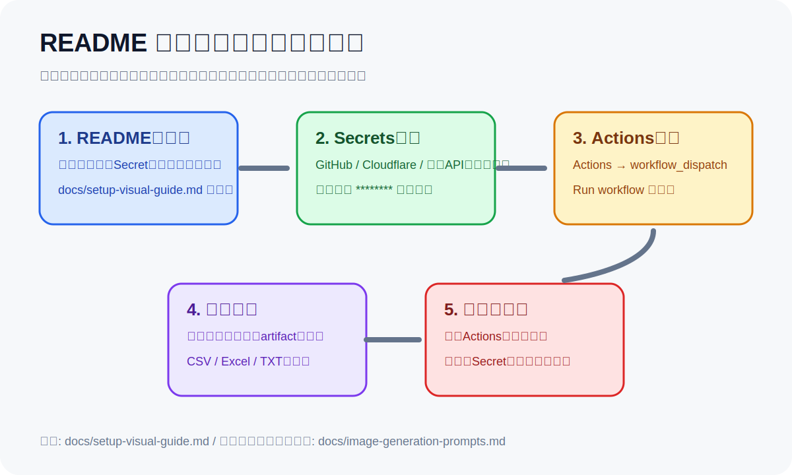

# 画像付き初期設定ガイド

## 1. 最初に見る場所

READMEの冒頭にある「画像付き初期設定ガイド」から、必要な設定と実行手順を確認します。

## 2. Secretsの考え方

実際の値はREADMEにもIssueにも貼りません。表示例は `********`、`YOUR_SECRET_HERE`、`your-folder-id` のようにマスクします。

代表的な確認場所:

- GitHub: Settings → Secrets and variables → Actions
- GitHub Actions: Actions → 対象workflow → Run workflow
- Cloudflare: Workers & Pages → 対象Worker → Settings → Variables and Secrets

## 3. 実行手順

1. README冒頭の必要Secret一覧を確認します。
2. GitHub Secrets または Cloudflare Secrets に値を登録します。
3. GitHub Actions の `Run workflow` を実行します。
4. Actionsログで成功・失敗を確認します。
5. Artifact、レポート、CSV、Excel、TXTなどの成果物をダウンロードします。

## 4. エラー時の見る順番

1. Actions の赤い失敗ステップ
2. Secret名のスペル
3. 権限不足、API制限、対象フォルダIDやURL
4. READMEのトラブルシューティング

## 5. AI画像生成で詳しい案内を作る場合

`docs/image-generation-prompts.md` のプロンプトを使い、利用可能な最新のGPT Image / ChatGPT Imagesモデルで、GitHub画面風の赤枠・番号付きガイドを生成してください。Secret値は絶対に実値表示しません。
